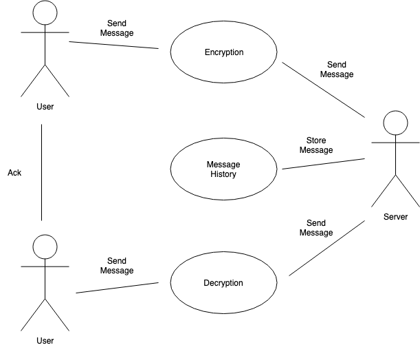

# Pay Station

## Project Abstract
Signal by Open Whisper Systems is a private messaging app available on Android and iOS devices, as well as on desktop. The open source repository in question is for the Android version of the app, as the majority of the code is in Java. The repo for the iOS version is mostly in Objective-C, while the repo for the desktop version is in JavaScript, with support for Windows, Mac, and Linux. Boasting the tagline "privacy that fits in your pocket", Signal is a fast, simple, and secure messaging service with extra emphasis on secure messaging. As an open source project supported by grants and donations, Signal has already been released in the app stores; however, the project is not yet complete, as there are bugs and issues to address within its various versions.

## Project Relevance
This project is relevant to the course in the aspects of Version Control _(seeing how the code was created and revised over time, thus allowing us to identify the bugs as they appeared over time)_, Debugging _(being able to understand the code that other contributers have provided and being able to revise them)_, and Issue Tracking _(proposing issues that have been noticed through use of the project / debugging, as well as working on resolving issues that have already been noticed)_. Being an open source app, Signal gives us the opportunity to contribute to the design, development, and maintenance aspect of the project. Issues that have been brought up in the repository range from UI bugs to network connectivity and transmission issues. 

## Conceptual Design
A contribution that I would like to take part in is to resolve one of the issues, particularly one that involves phone networking. Issue number 8625, _Messages marked as "failed to send" are delivered_ was the issue I had in mind. The issue was well-documented with screenshots and error logs of the incident, as well as descriptions of the phenomenon taking place between the devices. Essentially, a user was sending a message to one of his contacts, and while his phone gave him the error that the message did not send, his contact received the message. More details can be found in the issue itself (link provided in the background section below).

For this project, I would need interested teammates preferably with Android devices, although having iOS devices would also come in handy in order to cover all the bases. One teammate in particular would need a Samsung GT-N7100 phone, as the device in question was of that model. I realize that this may be too narrow of a requirement for this project to continue, so if those interested do not have this specific phone model, we can tackle another open issue in the repository.

## Background
https://github.com/signalapp/Signal-Android

https://github.com/signalapp/Signal-Android/issues/8625

https://signal.org/
